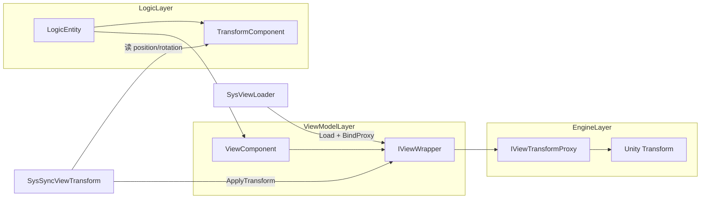
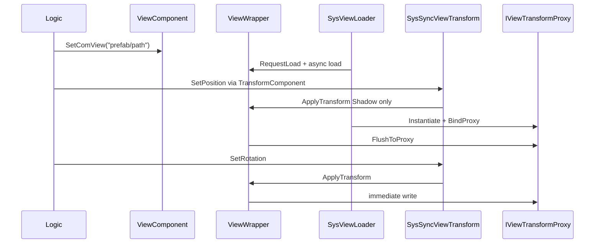

# ViewComponent + ViewWrapper 设计文档

## 1. 设计目标

`ViewComponent` 将逻辑 Entity 与引擎渲染对象解耦，使逻辑层在以下场景下使用同一套 API：

- Unity 运行时：异步加载 Prefab，绑定真实 `Transform`
- 命令行 / 纯逻辑：通过 `NullViewTransformProxy` 空实现，不依赖引擎

核心原则：**逻辑侧始终同步调用**，资源加载异步进行，由 ViewWrapper 的 Shadow State 缓冲加载完成前的变换数据。

## 2. MVVM 映射

| 角色 | 类型 | 职责 |
|------|------|------|
| Model | `TransformComponent` | 逻辑层权威位置、朝向、缩放 |
| ViewModel | `IViewWrapper` / `ViewWrapperBase` | 对外同步 API；缓存 Shadow Transform；管理 Proxy 生命周期 |
| View | `IViewTransformProxy` 实现 | 操作引擎 `Transform`；无引擎时用 Null 实现 |



## 3. 类型职责与生命周期

### ViewComponent

- 挂载于 `LogicEntity`，持有 `IViewWrapper` 与资源路径 `assetLocation`
- `loadState`：`None` → `Loading` → `Ready` / `Failed`
- `syncTransform`：是否参与 `SysSyncViewTransform` 同步（默认 `true`）
- `DisposeOnRemove`：释放 Wrapper、通过 `IAssetService` 释放资源

### IViewWrapper

定义于 `ViewComponent.cs`，是逻辑层访问表现的唯一入口：

- `ApplyTransform`：写入 Shadow，Proxy 就绪时立即刷到引擎
- `BindProxy`：加载完成后绑定 `IViewTransformProxy` 并 `FlushToProxy`
- `SetActive`：显隐控制（同样走 Shadow + Flush）

### IViewTransformProxy

引擎 Transform 的抽象，隔离 Unity 依赖：

- `UnityViewTransformProxy`：包装 `UnityEngine.Transform`
- `NullViewTransformProxy`：纯逻辑空实现，`IsValid = true`

### 生命周期

1. `SetComView(assetLocation)` → 添加组件，`loadState = None`
2. `SysViewLoader` 响应 Added/Replaced → `Loading` → 异步加载
3. 加载成功 → `Instantiate` → `BindProxy` → `Ready` → 刷入当前 `TransformComponent`
4. Entity 销毁 / 组件移除 → `DisposeOnRemove` → 销毁 GameObject、释放资源

## 4. Shadow State + Pending Flush

`ViewWrapperBase` 维护 `_position`、`_rotation`、`_scale`、`_active`：

1. `ApplyTransform` / `SetActive` **立即**更新 Shadow，不等待加载
2. 若 Proxy 已绑定且 `IsValid` → 同步写入 Proxy
3. 资源加载中 → 仅更新 Shadow
4. `BindProxy` 完成后调用 `FlushToProxy()`，一次性应用缓存



## 5. 纯逻辑 / 命令行运行

当 `GEnv.Inst.Services.AssetSvc` 不可用时，`SysViewLoader` 直接：

1. 绑定 `NullViewTransformProxy`
2. 标记 `Ready`
3. `FlushToProxy`（无引擎副作用）

逻辑代码路径与 Unity 运行时一致，无需分支判断。

## 6. System 协作

### SysViewLoader（ReactiveSystem）

- **Trigger**：`ComView` Added（含 Replace 触发的 Added）
- **Filter**：`hasComView && loadState == None && assetLocation` 非空
- **Execute**：标记 Loading → 异步加载 → BindProxy → Ready；失败则 Failed

### SysSyncViewTransform（ReactiveSystem）

- **Trigger**：`ComTransform` Added
- **Filter**：`hasComTransform && hasComView && syncTransform`
- **Execute**：读取 `position` / `rotation` / `scale`，调用 `wrapper.ApplyTransform`

朝向同步使用 `TransformComponent.rotation`（与 `SetFaceDir` 派生的 `WorldFaceDir` 一致）。

加载完成时，`SysViewLoader` 会额外调用一次 `ApplyTransform`，保证首帧与逻辑 Transform 对齐。

## 7. 使用示例

```csharp
var entity = logicWorld.CreateEntity();
entity.SetComTransform(Vector3.zero, Quaternion.identity, Vector3.one);
entity.SetComView("Characters/Hero");

// 逻辑移动 — 加载前后均可调用
entity.SetPosition(new Vector3(1, 0, 0));
entity.SetFaceDir(Vector3.forward);
```

## 8. 扩展点

- **自定义 Wrapper**：`ViewComponent.AttachWrapper(customWrapper)` 注入测试或特化实现
- **SysSyncViewAnimator**：后续可按相同 Reactive 模式同步动画参数
- **父节点挂载**：可在 `SysViewLoader` 实例化后设置 `SetParent`，或扩展 `IViewTransformProxy`
