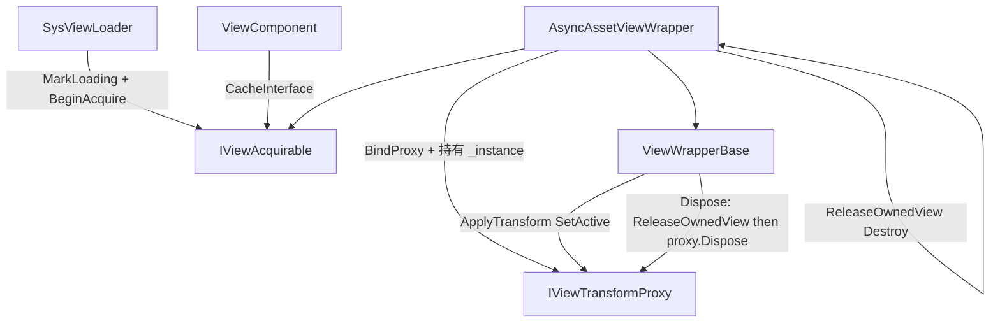

# ViewComponent + ViewWrapper 设计文档

## 1. 设计目标

`ViewComponent` 将逻辑 Entity 与引擎渲染对象解耦，使逻辑层在以下场景下使用同一套 API：

- Unity 运行时：异步加载 Prefab，绑定真实 `Transform`
- 命令行 / 纯逻辑：通过 `NullViewTransformProxy` 空实现，不依赖引擎

核心原则：**逻辑侧始终同步调用**；获取/释放策略由 `ViewWrapperBase` **子类**成对定义；Proxy 只做 Transform 操作与字段清理。

## 2. MVVM 映射

| 角色 | 类型 | 职责 |
|------|------|------|
| Model | `TransformComponent` | 逻辑层权威位置、朝向、缩放 |
| ViewModel | `IViewWrapper` / `IViewAcquirable` / `ViewWrapperBase` 子类 | Shadow、同步 API；**子类管整段获取+释放** |
| View | `IViewTransformProxy` | Set*；`Dispose` 只清字段（不 Destroy 资源） |



## 3. 类型职责与生命周期

### ViewComponent

- 持有 `List<IViewWrapper>`，`CacheInterface` 分流 `IViewAcquirable` / `IViewTransformSyncable`
- `MarkLoading` / `MarkReady` / `MarkFailed`：针对具体 `IViewAcquirable`
- `HasPendingAcquire`：任一 Acquirable 待获取

### ViewWrapperBase

- Shadow、`ApplyTransform`、`SetActive`、`BindProxy`、`FlushToProxy`
- `IsReady`：虚属性，默认 `true`（同步就绪的 Wrapper 无需加载状态）
- **不含** `LoadState` / `SetLoadState`（属 `IViewAcquirable` 实现侧）
- `Dispose` 模板：`ReleaseOwnedView()` → `proxy.Dispose()` → `OnDisposed()`
- `ReleaseOwnedView`：虚方法，默认空；**子类实现资源卸载**
- `OnDisposed`：虚方法，默认空；子类复位自身获取状态等
- `BindProxy`：只换绑句柄，**不**调用 `ReleaseOwnedView`（避免「先赋 `_instance` 再 Bind」时误毁）

### AsyncAssetViewWrapper（默认策略子类）

- 实现 `IViewAcquirable`；持有并推进 `LoadState`；`IsReady == (LoadState == Ready)`
- `AssetLocation` / `RequestLoad` 为本类具体 API
- `BeginAcquire`：`LoadAssetAsync` → Instantiate → 持有 `_instance` → `BindProxy(UnityViewTransformProxy)`
- `ReleaseOwnedView`：`Object.Destroy(_instance)`
- `OnDisposed`：复位 `LoadState = None`
- AssetSvc 不可用：绑 `NullViewTransformProxy`

### IViewAcquirable

```csharp
ViewLoadState LoadState { get; }
bool HasPendingAcquire { get; }
void BeginAcquire(ViewAcquireContext ctx);
void SetLoadState(ViewLoadState state);
```

### IViewTransformProxy

- `UnityViewTransformProxy.Dispose`：**仅清字段**，不 Destroy GO
- 资源卸载只在 Wrapper 子类；禁止往 Proxy 注入 `BeforeDispose(ref GameObject)` 作为主路径
- 将来 Proxy 自身可入池（与 GO 生命周期无关）

### 配对约束（禁止自由交叉）

| 获取策略（子类） | 释放（ReleaseOwnedView） | 产出 Proxy |
|------------------|--------------------------|------------|
| `AsyncAssetViewWrapper` | Destroy GO | `UnityViewTransformProxy` |
| 后续 Pool 子类 | ReturnToPool | 同左配套 |
| 后续 Scene 子类 | Detach-only | 同左配套 |

调用方只选 Wrapper 子类，从不单独拼装「加载策略 × 卸载策略」。

### 生命周期

1. `SetComView(path)` → 默认 `new AsyncAssetViewWrapper(path)` + `AddViewWrapper`
2. `SysViewLoader`：`HasPendingAcquire` → `MarkLoading` → `BeginAcquire`
3. 策略内部 BindProxy；回调 → `MarkReady` / `MarkFailed` + SyncTransform
4. 组件移除 → Wrapper.`Dispose` → `ReleaseOwnedView` + Proxy 清字段

## 4. Shadow State + Pending Flush

与此前相同：`ApplyTransform` / `SetActive` 立即写 Shadow；Proxy 就绪则 Flush。

## 5. System 协作

### SysViewLoader

- **只编排**：不碰 AssetSvc / Instantiate / `new UnityViewTransformProxy`
- Filter：`HasPendingAcquire`
- Execute：`MarkLoading` → `BeginAcquire` → 回调 `MarkReady/Failed` + `SyncTransformFromEntity`

### SysSyncViewTransform

- Filter：`HasSyncTransform`；对 `TransformSyncables` 调用 `ApplyTransform`

## 6. 使用示例

```csharp
entity.SetComView("Characters/Hero");
// 等价于 AddViewWrapper(new AsyncAssetViewWrapper("Characters/Hero"))

entity.SetPosition(new Vector3(1, 0, 0));
```

## 7. 扩展点

- 新策略：新增 `ViewWrapperBase` 子类，实现 `IViewAcquirable` + `ReleaseOwnedView`，在 `BeginAcquire` 内产出配套 Proxy
- 不要做 AcquireStrategy × ReleaseStrategy 配置矩阵
- 不要把加载逻辑塞进 Proxy 子类
